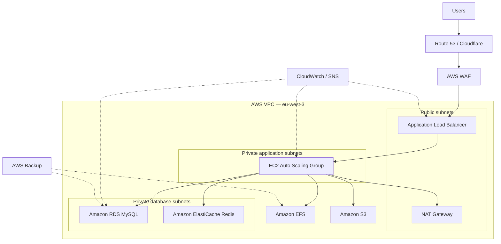

# Leyton WordPress Infrastructure on AWS

Terraform configuration for deploying a secure, scalable, and observable
WordPress platform on Amazon Web Services.

> [!NOTE]
> This repository currently targets the **staging** environment only and is
> under active development.

## Project overview

| Setting | Value |
|---|---|
| Environment | `staging` |
| AWS Region | `eu-west-3` — Europe (Paris) |
| Infrastructure as Code | Terraform |
| Cloud provider | Amazon Web Services |
| Application | WordPress |

## Target architecture



The diagram represents the intended architecture. Individual components will
be enabled as their Terraform configuration is completed.

## Repository structure

```text
.
├── network/       # VPC, subnets, gateways, routes and network ACLs
├── security/      # Security groups, IAM, KMS and WAF
├── compute/       # ALB, EC2 launch template and Auto Scaling
├── database/      # RDS, Redis and database subnet groups
├── storage/       # EFS, mount targets, access points and S3
├── dns/           # Route 53 and optional Cloudflare records
├── monitoring/    # CloudWatch, SNS, EventBridge and Lambda
├── backup/        # AWS Backup vault, plan and resource selection
├── docs/          # Architecture, networking and operations documentation
├── versions.tf    # Terraform and provider version constraints
├── providers.tf   # AWS provider configuration
├── variables.tf   # Root input variables
├── locals.tf      # Shared names and tags
└── outputs.tf     # Root outputs
```

## Prerequisites

- Terraform installed locally
- An AWS account with suitable permissions
- AWS credentials configured through the AWS CLI or environment variables
- Git for source control

Do not store AWS credentials directly in Terraform files.

## Getting started

```bash
# Format the configuration
terraform fmt -recursive

# Download the required providers
terraform init

# Check the configuration
terraform validate

# Preview the staging changes
terraform plan

# Deploy only after reviewing the plan
terraform apply
```

## Terraform state

Terraform state files can contain sensitive infrastructure data and must never
be committed. Before shared or production use, configure a remote S3 backend
with state locking and encryption.

The repository's `.gitignore` excludes local state, plans, credentials, private
keys, and local variable files.

## Safety rules

- Never commit secrets, AWS credentials, private keys, or Terraform state.
- Run `terraform fmt`, `terraform validate`, and `terraform plan` before every
  apply.
- Review the complete plan before approving infrastructure changes.
- Use least-privilege IAM permissions.
- Apply changes to staging before promoting an architecture to production.

## Current status

The repository structure and staging foundation are being prepared. Resource
configuration will be implemented incrementally, beginning with the Terraform
versions, AWS provider, shared variables, and networking layer.
